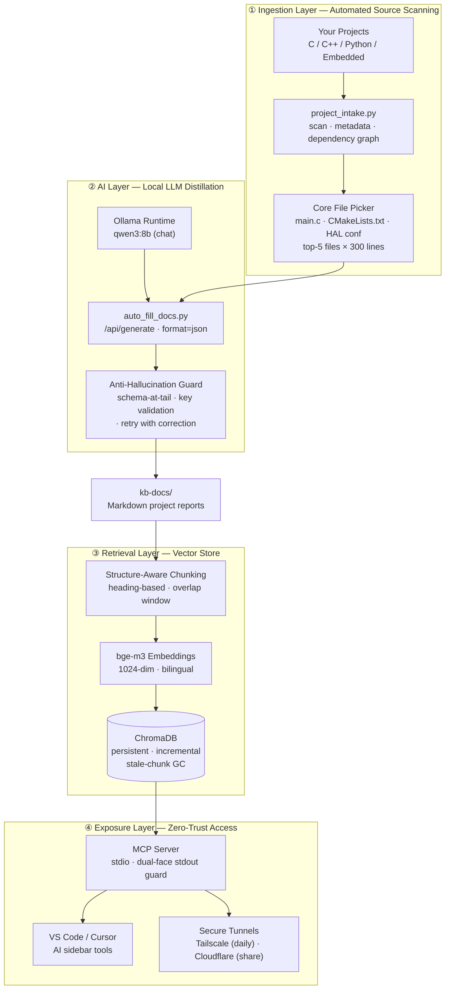

<div align="center">

# KB-Stack

**Zero-Trust Local AI Knowledge Base for Your Unfinished Projects**

*Turn scattered half-finished side projects into a searchable, queryable, AI-assisted asset — entirely on your own machine.*

[](https://www.python.org/)
[](https://docs.docker.com/compose/)
[](https://ollama.com/)
[](https://modelcontextprotocol.io/)
[](LICENSE)
[]()

[English](#english) · [中文](#中文文档)

</div>

---

## English

### Why KB-Stack?

Every developer has a graveyard of half-finished projects. You know the pain: a folder named `motor_driver_v2_FINAL`, last touched eight months ago, with no idea what was done, what broke, or whether the TODO comments are still accurate.

KB-Stack solves this with a **fully local pipeline** that reads your source code, asks a local LLM to reconstruct the project's real state, stores everything in a vector database, and exposes it as tools your editor's AI can call directly.

**No cloud. No API keys. No data leaves your machine.**

### Architecture



**Data flow:** source code → scanned and distilled by a local LLM into structured Markdown reports → chunked and embedded into ChromaDB → served to your editor's AI via MCP, or reached remotely through zero-open-port tunnels.

### Features

| | Feature | What it means |
|---|---|---|
| 🔒 | **100% Local Execution** | Your code, docs, and embeddings never leave the machine. Ollama handles all inference; no telemetry, no cloud calls. |
| 🪶 | **Minimal-Dependency RAG** | The entire retrieval engine is ~370 lines of readable Python on top of ChromaDB — no LangChain, no LlamaIndex, no framework tax. Debuggable end to end. |
| 🛡 | **Hallucination Guards** | The LLM is instructed to say "not recorded in the documents" instead of inventing answers. A schema-at-tail prompt layout defeats format poisoning from JSON literals embedded in your source code. |
| 🔌 | **MCP-Native Integration** | Ships a Model Context Protocol server (stdio) so VS Code and Cursor AI can call `search_knowledge_base` and `ask_knowledge_base` as first-class tools. |
| 🌐 | **Dual-Track Zero-Trust Networking** | Host machine listens on **zero public ports**. Daily access via Tailscale (WireGuard P2P); sharing via Cloudflare Tunnel with email-gated Access. |
| ♻️ | **Incremental & Self-Cleaning Index** | Content-hash chunk IDs skip re-embedding unchanged text; a two-pass scan garbage-collects stale chunks that `upsert` alone would leave behind forever. |
| 🧠 | **Code-Aware File Selection** | Prioritizes entry points, build files, and MCU/HAL headers (`main.c`, `CMakeLists.txt`, `stm32f1xx_hal_conf.h`) before falling back to keyword hits and file size. |

### Quick Start

#### Prerequisites

- **Python** 3.10+
- **Ollama** running locally, with two models pulled:
  ```bash
  ollama pull qwen3:8b      # chat model (swap for qwen3:14b if you have VRAM)
  ollama pull bge-m3        # embedding model, 1024-dim, bilingual
  ```
- **Docker** + Compose v2 *(only for the server deployment track)*

#### 1. Clone and install

```bash
git clone https://github.com/<your-username>/kb-stack.git
cd kb-stack
pip install requests chromadb mcp
```

#### 2. Generate reports from your projects

```bash
# Scan a directory of projects → generate one Markdown report per project
# Single root
python project_intake.py /path/to/your/projects -o ./kb-docs --author "Your Name"

# Multiple roots (native support — no symlinks needed):
python project_intake.py /path/a /path/b -o ./kb-docs --depth 2

# Or configure REPOS_DIRS in .env and just run:
python project_intake.py -o ./kb-docs

# Let the local LLM read core sources and fill in status + next-step strategy
python auto_fill_docs.py --docs-dir ./kb-docs
```

#### 3. Build the vector index

```bash
python kb_rag.py index ./kb-docs --collection kb-projects
```

#### 4. Query it

```bash
python kb_rag.py search "motor driver PWM"        # pure retrieval, instant
python kb_rag.py ask "what's the status of the OCR project?"   # retrieval + LLM summary
python kb_rag.py chat                              # interactive session
```

#### 5. Wire it into your editor (MCP)

Copy `mcp-config-template.json` into your MCP settings and replace the two placeholders:

```json
{
  "mcpServers": {
    "kb-rag": {
      "command": "<ABSOLUTE_PATH_TO_YOUR_PYTHON>",
      "args": ["<ABSOLUTE_PATH_TO_REPO>/mcp_server.py"],
      "env": { "OLLAMA_HOST": "127.0.0.1:11434", "PYTHONIOENCODING": "utf-8" }
    }
  }
}
```

Then ask your editor's AI: *"Search my knowledge base for the OCR project."* See [MCP_SETUP.md](MCP_SETUP.md) for detailed steps.

#### 6. Optional — full server stack with zero open ports

```bash
bash deploy-precheck.sh /srv/kb     # 12-point environment audit
cp .env.example .env && vim .env    # fill in placeholders
sudo bash init.sh                   # create dirs, pull models, start services
docker compose --profile ts up -d   # add Tailscale tunnel (or --profile cf)
```

See [deployment-tunnels.md](deployment-tunnels.md) for the Cloudflare vs Tailscale comparison.

### Project Layout

```
kb-stack/
├── project_intake.py        # scan projects (multi-root via REPOS_DIRS) → report skeletons
├── auto_fill_docs.py        # local LLM fills status & strategy sections
├── kb_rag.py                # RAG engine: chunk · embed · index · query
├── mcp_server.py            # MCP stdio server (2 tools, stdout-hardened)
├── kb_dashboard.py          # zero-dependency browser dashboard (local)
├── build_static.py         # build static site for hosting platforms
├── templates/               # project report template
├── docker-compose.yml       # 6-service stack, version-pinned, zero ports
├── deploy-precheck.sh       # pre-deployment environment audit
├── backup.sh                # cold backup with rotation
├── deployment-tunnels.md    # Tailscale / Cloudflare Tunnel guide
└── MCP_SETUP.md             # editor integration guide
```

### Hard-Won Design Notes

These are all bugs found by running the thing, not by reading docs:

1. **ChromaDB + a live anyio event loop deadlocks** on Windows. The MCP server pre-warms ChromaDB *before* the event loop starts — do not remove that line.
2. **`stdout` is a single-lane pipe** in MCP stdio transport. The server installs a dual-face stdout wrapper: `.write()` → stderr for stray prints, `.buffer` → protocol fd for JSON-RPC.
3. **`upsert` never deletes.** Chunk content changes produce new hash-IDs while the old ones linger and pollute retrieval. `kb_rag.py` does an exact-ID diff and GCs the leftovers.
4. **Local models mimic the last JSON they see.** If your source code contains JSON literals, the model will copy them instead of analyzing. The schema instruction must come *after* the source dump.
5. **Never put SQLite/Chroma data on NTFS or NFS.** Random lock-ups. `deploy-precheck.sh` fails hard on this.

### License

MIT — see [LICENSE](LICENSE).

---

## 中文文档

### KB-Stack 是什么？

每个开发者都有一个「半成品项目墓地」。你熟悉这种痛苦：一个叫 `motor_driver_v2_FINAL` 的文件夹，上次打开是八个月前，你已经不记得做了什么、哪里坏了、那些 TODO 注释还算不算数。

KB-Stack 用一条**全本地流水线**解决它：读取你的源码 → 让本地大模型重建项目真实状态 → 存入向量库 → 暴露成编辑器 AI 可直接调用的工具。

**无云端、无 API Key、数据不出本机。**

### 核心特性

| | 特性 | 说明 |
|---|---|---|
| 🔒 | **100% 纯本地运行** | 代码、文档、向量全部留在本机，推理走 Ollama，无遥测无云调用 |
| 🪶 | **极简 RAG，零框架依赖** | 检索引擎仅约 370 行可读 Python（仅依赖 ChromaDB），不用 LangChain/LlamaIndex，全链路可调试 |
| 🛡 | **自动规避幻觉** | 提示词强制「文档未记录就说未记录」；schema 置于 prompt 末尾，破解源码内嵌 JSON 导致的格式污染 |
| 🔌 | **MCP 原生集成** | 内置 MCP stdio 服务端，VS Code / Cursor 的 AI 可直接调用检索与问答两个工具 |
| 🌐 | **双轨零信任网络** | 宿主机**零公网端口**；日常走 Tailscale（WireGuard P2P 直连），分享走 Cloudflare Tunnel（邮箱门禁） |
| ♻️ | **增量索引 + 自动清理** | 内容哈希 ID 跳过未变更文本；两轮扫描回收 `upsert` 永远删不掉的旧块 |
| 🧠 | **代码感知选材** | 优先入口文件与构建/HAL 配置（`main.c`、`CMakeLists.txt`、`stm32f1xx_hal_conf.h`），再退到关键词与体积排序 |

### 快速开始

```bash
# 0. 前置：Ollama 已运行并拉取模型
ollama pull qwen3:8b && ollama pull bge-m3

# 1. 克隆与安装
git clone https://github.com/<your-username>/kb-stack.git
cd kb-stack && pip install requests chromadb mcp

# 2. 扫描项目生成复盘文档（含 AI 自动填写状态与破局思路）
# Single root
python project_intake.py /path/to/your/projects -o ./kb-docs --author "Your Name"

# Multiple roots (native support — no symlinks needed):
python project_intake.py /path/a /path/b -o ./kb-docs --depth 2

# Or configure REPOS_DIRS in .env and just run:
python project_intake.py -o ./kb-docs
python auto_fill_docs.py --docs-dir ./kb-docs

# 3. 建立向量索引
python kb_rag.py index ./kb-docs --collection kb-projects

# 4. 提问
python kb_rag.py ask "OCR 项目现在什么进度？"

# 5. 启动本地看板与只读项目 API
python kb_dashboard.py --port 8765
# GET http://127.0.0.1:8765/api/projects
# 可用 KB_DASHBOARD_CORS_ORIGIN 或 --cors-origin 限制允许的前端来源

# 6. 接入编辑器（可选）：复制 mcp-config-template.json，替换两个占位符
#    详见 MCP_SETUP.md

# 7. 完整服务器栈（可选，零公网端口）
bash deploy-precheck.sh /srv/kb && cp .env.example .env && sudo bash init.sh
```

`GET /api/projects` 返回项目名称、状态、更新时间、摘要、技术栈、TODO 与统计数据。响应默认包含 `Access-Control-Allow-Origin: *`，供静态前端读取；生产环境可将来源收紧为 `https://blog.liuguangzhong.top`。

### 实测踩坑记录

这些不是读文档读出来的，是跑出来的：

1. **ChromaDB 与运行中的 anyio 事件循环在 Windows 上死锁** → MCP 服务在事件循环启动前预热 ChromaDB，该行不可删
2. **MCP stdio 的 stdout 是独占管道** → 双面 stdout 替身：`write()` 转 stderr、`buffer` 保留协议通道
3. **`upsert` 只增不删** → 文档更新后旧哈希块永久残留污染检索，`kb_rag.py` 做精确 ID 差集回收
4. **本地模型会模仿它看到的最后一个 JSON** → 源码里若有 JSON 字面量，模型会照抄而非分析，schema 指令必须放在源码之后
5. **SQLite/Chroma 数据禁止放 NTFS/NFS** → 随机锁死，`deploy-precheck.sh` 会直接判失败

### 许可

MIT，详见 [LICENSE](LICENSE)。
