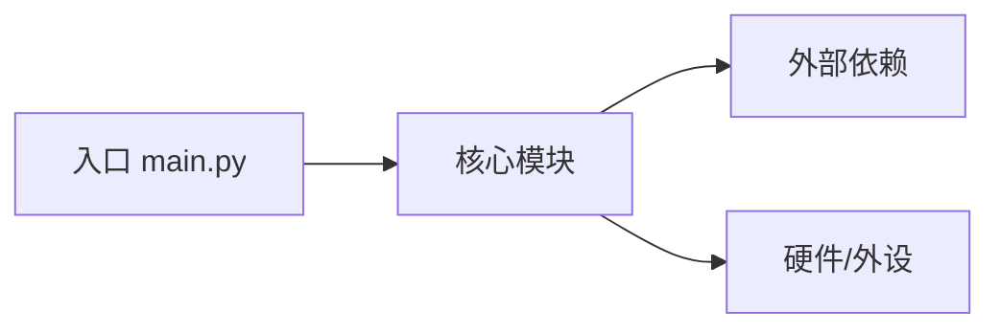

# {{项目名}} —— 项目复盘与交接文档

> 录入人：{{你的名字}}　录入日期：{{YYYY-MM-DD}}　文档版本：v0.1
> 一句话定位：{{这个项目是干什么的，30 字以内}}

---

## 1. 项目元数据（Metadata）

| 字段 | 内容 |
|---|---|
| 项目名称 | {{项目名}} |
| 本地路径 | `{{绝对路径，用于回溯}}` |
| 首次开发日期 | {{YYYY-MM}} |
| 最后活跃日期 | {{YYYY-MM-DD，以最后提交/文件 mtime 为准}} |
| 项目阶段 | 成品 ☐　可演示 ☐　半成品-搁置 ☐　半成品-活跃 ☐　想法验证 ☐　已废弃 ☐（勾选） |
| 技术栈-语言 | {{C/C++、Python、Shell…}} |
| 技术栈-框架/库 | {{Flask、HAL 库、LVGL…}} |
| 构建系统 | {{CMake / Make / PlatformIO / Keil / 无（解释执行）}} |
| 运行环境 | {{Python 3.11 / Ubuntu 22.04 / STM32F103 / Windows 10}} |
| 硬件依赖 | {{开发板型号、传感器、调试器（ST-Link/J-Link）、无}} |
| 代码规模 | {{N 个源文件 / 约 M 行（`cloc` 或 `wc -l` 估算）}} |
| 版本控制 | {{Git（远程仓库地址）/ Git（仅本地）/ 无}} |
| 许可证 | {{MIT / GPL / 闭源个人}} |

---

## 2. 当前状态定义（Status）

### 2.1 状态总览

- **整体状态**：{{半成品-搁置}}
- **可用性**：{{能跑通哪些入口？`python main.py` 能启动但登录模块报错，之类}}
- **搁置原因**（若适用，勾选 + 补充）：
  - [ ] 技术卡点（{{卡在哪：内存溢出 / 驱动不通 / 架构死锁}}）
  - [ ] 需求变化（优先级被别的项目挤掉）
  - [ ] 环境变化（SDK 失效 / 硬件损坏 / 依赖停止维护）
  - [ ] 动力中断（兴趣转移、学习目标已达成）
  - [ ] 性能/成本不达标（{{跑不动、太贵、太大}}）
  - 其他：{{文字描述}}

### 2.2 已完成模块 ✅

| 模块 | 位置（路径） | 完成度 | 验证方式 |
|---|---|---|---|
| {{会话管理}} | `{{monitor/session.py}}` | {{90%}} | {{mock_server 全流程跑通}} |
| {{二维码登录}} | `{{monitor/login.py}}` | {{70%}} | {{手动登录成功过一次}} |

### 2.3 缺失/损坏模块 ❌

| 模块 | 缺什么 | 影响 | 修复难度预估 |
|---|---|---|---|
| {{重试机制}} | {{完全没有}} | {{网络抖动即崩溃}} | {{低}} |
| {{持久化}} | {{写了但未测试}} | {{重启丢状态}} | {{中}} |

### 2.4 已知 Bug / 债务清单

| # | 现象 | 复现步骤 | 初步定位 | 优先级 |
|---|---|---|---|---|
| 1 | {{描述}} | {{步骤}} | {{文件:行号 或 未知}} | P0/P1/P2 |

---

## 3. 核心业务逻辑 / 架构说明（Architecture）

### 3.1 架构图



### 3.2 模块职责表

| 模块/目录 | 职责 | 关键接口/函数 | 备注 |
|---|---|---|---|
| `{{monitor/}}` | {{业务核心}} | `{{class Session}}` | {{…}} |

### 3.3 数据流 / 控制流（用文字讲清一条主链路）

{{挑最核心的一条链路，从输入到输出写一遍。例：用户点击 → CLI 解析 → 状态机切换 → UART 发送 → 传感器回包 → 上位机渲染。}}

### 3.4 关键设计决策（为什么当时这么做）

| 决策 | 备选方案 | 当时选它的原因 | 现在还成立吗 |
|---|---|---|---|
| {{用 ini 不用 yaml}} | {{yaml}} | {{零依赖}} | {{✅/❌ 理由}} |

### 3.5 环境复现步骤（新机器多久能跑起来）

```bash
# {{git clone ... / pip install -r requirements.txt / cmake .. && make}}
# {{烧录命令 openocd -f ... / 运行入口}}
```

---

## 4. 下一步开发计划与破局思路（Next & Unblock）

### 4.1 TODO List

- [ ] P0：{{不解决就没法继续的事}}
- [ ] P1：{{显著提升价值的事}}
- [ ] P2：{{锦上添花}}
- [ ] 交接确认：{{若移交他人，读哪三个文件就能上手？}}

### 4.2 破局四问（针对搁置项目的重启检查单）

1. **卡点还在吗**：{{当时的障碍是客观的（硬件/依赖）还是主观的（畏难）？客观障碍现在消失了吗？}}
2. **最小可行动作**：{{未来 30 分钟能做的第一步是什么？跑通一个测试？补一个空函数？}}
3. **要不要降级**：{{砍掉哪个模块，项目就能以 60% 完成度先"成品化"？}}
4. **还是该归档**：{{如果三个月内不会碰，明确写"归档"，别让它在活跃列表里耗注意力。}}

### 4.3 资产 salvage 清单（即使废弃也值得留下的东西）

| 资产 | 位置 | 复用价值 |
|---|---|---|
| {{通用重试装饰器}} | `{{utils/retry.py}}` | {{可直接拷到任何项目}} |

---

## 5. 附录：自动抓取的原始信息（脚本生成，勿手改）

> 以下由 `project_intake.py` 自动填充，与源码目录同步更新。

```text
{{AUTO_GENERATED_SECTION}}
```
